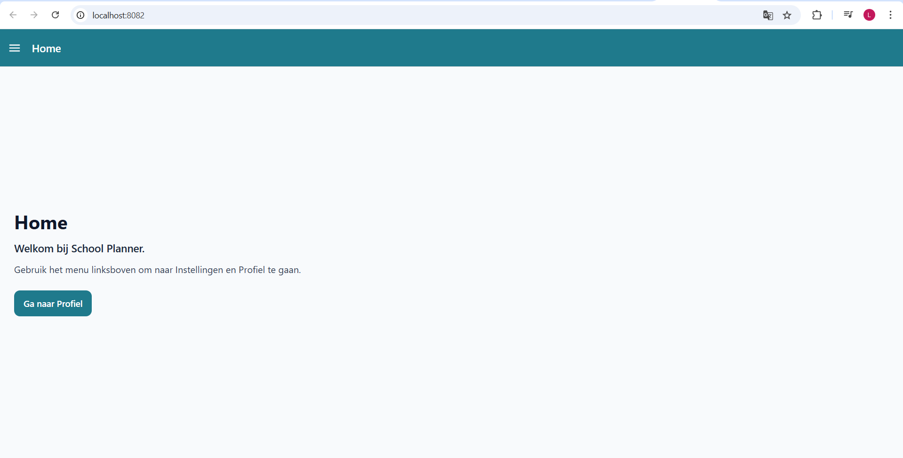
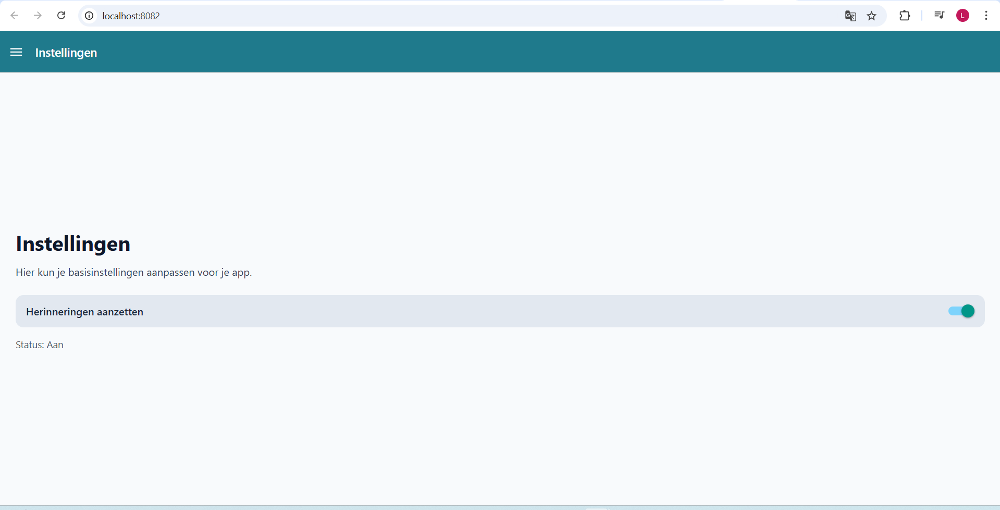
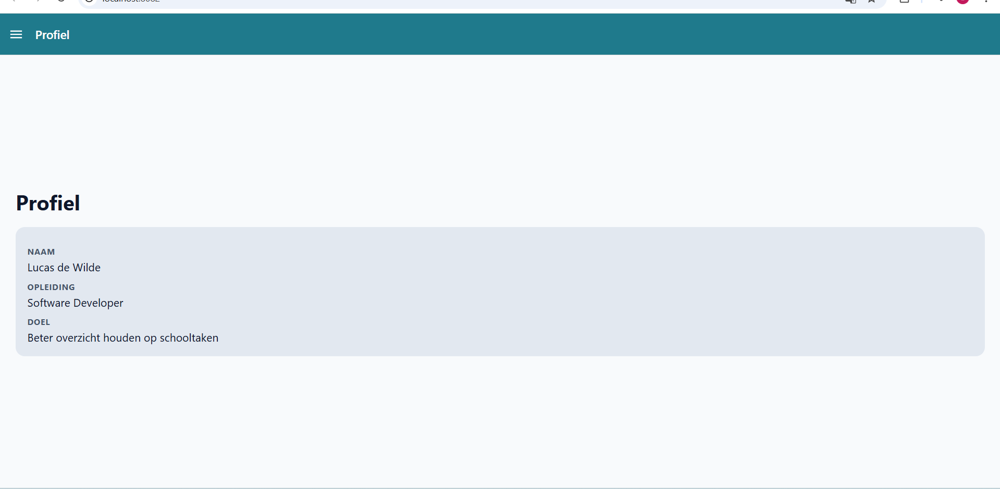

# School Planner

Een eenvoudige app om schooltaken, toetsen en deadlines overzichtelijk bij te houden.

## 1. App-idee

School Planner is een handige planner voor iedereen die op school zit.
Je voegt taken toe per vak, zet er een deadline op en vinkt ze af zodra je klaar bent.
Zo zie je in een keer wat nog moet gebeuren en wat al af is.

Waarom dit een logisch idee is:

1. Veel scholieren en studenten verliezen snel het overzicht.
2. Het probleem is herkenbaar en realistisch.
3. De app is technisch haalbaar voor een eerste project.

## 2. Doelgroep

1. Iedereen die op school zit
2. Van middelbaar onderwijs tot hoger onderwijs
3. Vooral mensen die meer overzicht willen in hun planning

## 3. Hoofddoel van de app

Gebruikers helpen om hun schoolwerk beter te plannen, zodat ze minder stress hebben.

## 4. Basisfuncties (eerste versie)

1. Taak toevoegen met titel, vak en deadline
2. Overzicht van alle taken
3. Filter op vak (bijvoorbeeld Nederlands, Engels, Rekenen/Wiskunde)
4. Taak markeren als voltooid
5. Simpel dashboard met:
   - aantal open taken
   - aantal voltooide taken

## 5. Technologie

1. React Native met Expo
2. React Navigation (Drawer + Bottom Tabs + Stack)
3. TypeScript
4. Axios voor API-calls
5. NewsAPI voor nieuwsartikelen

## 6. Ontwikkelingsfase

### Fase 1: Voorbereiding

1. README en projectplan opstellen
2. Schermen bepalen: Home, Instellingen, Profiel

### Fase 2: Basisfunctionaliteit

1. Drawer Navigation opzetten
2. Home-scherm bouwen
3. Instellingen-scherm bouwen
4. Profiel-scherm bouwen

### Fase 3: Verbetering

1. Filter op vak toevoegen
2. Dashboard met simpele statistieken
3. Layout verbeteren voor mobiel

## 7. Voortgangsupdates

### Opdracht 2: React Navigation Drawer

Resultaat:

1. Drawer Navigation werkt met React Navigation
2. Drie schermen zijn aanwezig: Home, Instellingen, Profiel
3. Elk scherm heeft een eigen StyleSheet-bestand

### Opdracht 3: React Navigation Bottom

Resultaat:

1. Bottom Navigation werkt met React Navigation
2. Drie schermen zijn aanwezig: Home, Instellingen, Profiel
3. Elk scherm gebruikt een aparte StyleSheet-file

Wat is aangepast:

1. App start nu met een Bottom Tab Navigator
2. Home, Instellingen en Profiel zijn als tabs gekoppeld
3. Navigatiebalk staat onderaan de app

### Opdracht 4: React Navigation Stack

Resultaat:

1. Stack Navigation werkt met React Navigation
2. Drie schermen zijn aanwezig: Home, Instellingen, Profiel
3. Elk scherm gebruikt een aparte StyleSheet file

Wat is aangepast:

1. App start nu met een Native Stack Navigator
2. Schermen zijn stapelbaar en navigeerbaar met terug knop
3. Headers hebben juiste styling met back button

### Opdracht 5: Nieuwszoekmachine API

Resultaat:

1. Gebruiker kan een zoekterm invullen in TextInput
2. Met de zoekknop wordt nieuws opgehaald via api
3. Resultaten worden getoond in een flatlist
4. Elk item laat zien: titel, beschrijving, afbeelding en publicatiedatum

Wat is aangepast:

1. Home-scherm omgebouwd naar nieuwszoekmachine
2. Axios toegevoegd voor newsapi 
3. Private api-config in een apart bestand

### Update 2026-03-31

1. App-idee gekozen
2. Doelgroep en hoofddoel vastgelegd
3. Eerste versie van project-README uitgewerkt
4. React Navigation Drawer gemaakt met 3 schermen: Home, Instellingen, Profiel
5. Styling opgesplitst in aparte files
6. React Navigation Bottom gemaakt met 3 tabs: Home, Instellingen, Profiel
7. React Navigation Stack gemaakt met 3 schermen
8. Nieuwszoekmachine met NewsAPI gebouwd op het Home-scherm

Volgende stap:

1. Kleine verbeteringen aan UI en content van de schermen
2. Reflectie-sectie aanvullen op het einde van de opdracht

## 8. Logboek (wat en waarom)

| Datum | Wat gedaan | Waarom |
| --- | --- | --- |
| 2026-03-31 | Nieuwe README gemaakt met volledig projectvoorstel | Nodig voor de opdracht |
| 2026-03-31 | Drawer Navigation toegevoegd met Home, Instellingen en Profiel | Voldoen aan opdracht 2 (React Navigation Drawer) |
| 2026-03-31 | Styles opgesplitst naar aparte files per scherm en drawer-thema | Betere code-structuur en duidelijkheid |
| 2026-03-31 | Bottom Navigation toegevoegd met Home, Instellingen en Profiel | Voldoen aan opdracht 3 (React Navigation Bottom) |
| 2026-03-31 | Stack Navigation toegevoegd met Home, Instellingen en Profiel | Voldoen aan opdracht 4 (React Navigation Stack) |
| 2026-03-31 | NewsAPI zoekfunctie toegevoegd met axios en flatlistt | Voldoen aan opdracht 5 (Nieuwszoekmachine API) |


## 9. Problemen en uitdagingen

Wordt aangevuld tijdens de bouw van de app.

Voorlopig:

1. Tunnel (ngrok) werkte niet goed
2. Oplossing: app draaien via LAN met npx expo start --host lan -c

## 10. Screenshots en video

Screenshots van de huidige versie:

Opdracht 2: React Navigation Drawer

1. Home-scherm: 
2. Instellingen-scherm: 
3. Profiel-scherm: 
4. Korte video: <video controls src="20260331-1911-21.6484080.mp4" title="Title"></video>


Opdracht 3: React Navigation Bottom

1. Home-scherm: 
2. Instellingen-scherm: 
3. Profiel-scherm: 
4. Korte video: <video controls src="20260331-1917-57.5061422.mp4" title="Title"></video>

Opdracht 4: React Navigation Stack

1. Home-scherm: 
2. Instellingen-scherm: 
3. Profiel-scherm: 
4. Korte video: <video controls src="20260331-1932-58.0011514.mp4" title="Title"></video>


Opdracht 5: Nieuwszoekmachine API

1. Home-scherm (zoekfunctie + resultaten):   |  

2. Instellingen-scherm: 
3. Profiel-scherm:
4. Korte video: 


## 11. Reflectie en leerpunten

Wordt op het einde van de projectperiode ingevuld.

Te reflecteren op:

1. Wat ging goed in planning en uitvoering
2. Wat moeilijk was en hoe dat is opgelost
3. Wat ik de volgende keer anders zou doen

## 12. Installatie en gebruik

### Vereisten

1. Node.js (LTS)
2. npm
3. Expo Go (optioneel)

### Installatie

```bash
npm install
```

### App starten

```bash
npx expo start --host lan -c
```

Daarna in de terminal:

1. Druk op w voor web
2. Druk op a voor Android
3. Scan QR-code met Expo Go op je smartphone

## 13. GitHub en inleveren

Dit project wordt gehost op GitHub.

Repository:

https://github.com/lucas-dw16/fe-thema2

In te dienen:

1. Link naar de repository: https://github.com/lucas-dw16/fe-thema2
2. Bijgewerkte README met voortgang, logboek en reflectie


